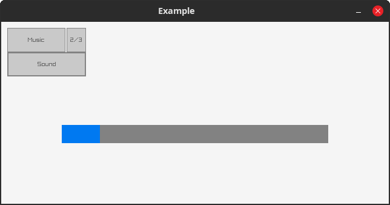

# Raylib.lean

Lean4 bindings to [raylib](https://github.com/raysan5/raylib) `5.5`, including Raymath and Raygui `4.0-dev`.

## Examples

Running (on Linux only):
1. Clone this repository
2. `cd` into cloned repository root
3. `lake -R -Kfork -Kraygui run raylib/buildSubmodule`
4. `lake exe examples.Minimal`

Examples assume working directory to be the library repository root.
Some require certain lake configuration options to be set (command above configures them).

See also: raylib's [examples](https://github.com/raysan5/raylib/tree/master/examples) directory.

<details>
  <summary>List with images</summary>
  <h4>Minimal</h4>
  <a href="./examples/Minimal.lean"></a>
  <h4>Raygui</h4>
  <a href="./examples/Gui.lean"></a>
  <h4>Audio</h4>
  <a href="./examples/Audio.lean"></a>
  <h4>Video mode</h4>
  <a href="./examples/VideoMode.lean"></a>
</details>


## Installation

Add this to `lakefile.lean`:
```
require raylib from git
  "https://github.com/KislyjKisel/Raylib.lean" @ "main"
```

To the `lean_exe` target add:
```
moreLinkArgs := #["-Llake-packages/raylib/raylib/build/raylib", "-lraylib"]
```

Then run `lake update` and `lake run raylib/buildSubmodule`.

<details>
<summary>Installation problems</summary>
<br>

* First build may take some time (around 10-20 minutes) to download raylib.
* On the first build git may return error 128.
  Usually restarting the build or re-cloning the raylib's repo helps.
* By default Lean's built-in C compiler is used to build ffi.
  On Windows it fails due to missing stdlib headers.
  You can use a different C compiler by passing the `cc` option
  with the compilers path (options are described above).
  To build raylib `cmake` and `git` from `PATH` are used.
  If you don't have them in PATH you can provide their paths with options `git` and `cmake`.
  If you want to clone and/or build raylib manually you can provide empty `git` and `cmake` options
  and then run required commands (which can be found in the [lakefile](/lakefile.lean) in `buildRaylibSubmodule`).
  You can also use `raylib` option set to `custom` and provide separately built raylib via the `cflags` options (and `lflags` for examples).
  See [#3](https://github.com/KislyjKisel/Raylib.lean/issues/3) and [#5](https://github.com/KislyjKisel/Raylib.lean/issues/5).

</details>


## Options

Options can be specified by appending `with $opts` (where `$opts` is a `NameMap`) to the `require` statement

* `raylib`:
  `"submodule"` (default) to compile from source using git submodules.
  `"system"` to find using `pkg-config` (uses hardcoded paths for examples).
  `"custom"` to not pass library or header directories to the compiler.
* `raygui`: allows using `Raygui`, downloads it as a submodule.
* `cc`: c compiler invoked used to build native code.
  By default uses (ordered by priority) `LEAN_CC`, the compiler provided by Lean toolchain or `cc`.
* `cflags`: additional flags passed to the native code compiler.
* `lflags`: additional flags used to link examples.
* `cmdout`: if present, print output of commands used when building submodule.
* `fork`: use raylib's [fork](https://github.com/KislyjKisel/raylib) that provides features used by
  implementations of some functions (notably audio callbacks) and some more.
* `alloc`: allocator for external (opaque ffi) objects.
  `"lean"` (default) means using the allocator Lean uses.
  `"native"` to use `malloc` and `free` instead.
* `git`, `cmake`: git and cmake used to build raylib submodule, or `""` (empty string) to skip their respective steps.
* `precompileRaymath`: if set enables `precompileModules` for Raymath.

There are also [options to customize raylib build](options.md).


## Scripts

* `buildSubmodule`: initializes submodule and builds it. Runs as part of the bindings build process.
* `cleanCmakeCache`: removes `build` directory from the submodule.
* `options`: prints configured lake options (doesn't include cmake build options).
